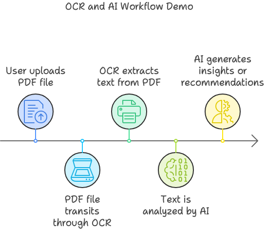
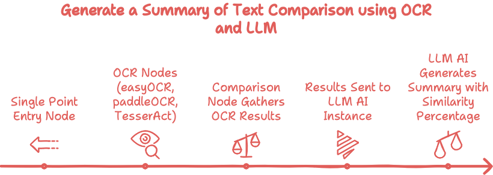
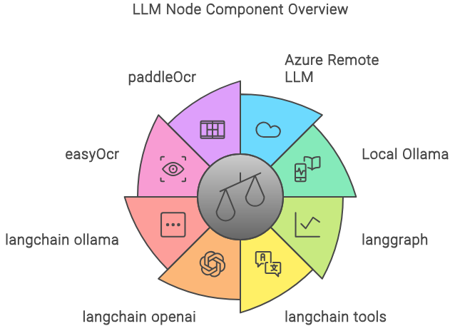

# invoice-classificator
Automating pdf Invoice (or any kind of document) Classification with Chainlit, Langraph, Azure openai gpt, Tesseract, and EasyOCR

## Summary

This project is a Proof of Concept (PoC) demonstrating the integration of Optical Character Recognition (OCR) and AI for invoice classification. It utilizes `langgraph` workflows to enable users to upload a PDF file, which is processed through a custom workflow, resulting in a comparative analysis from various OCR engines and a final assessment from a Language Model (LLM).

### Workflow Design based on langgraph

The workflow is designed as follows:



1. **Entry Node**: A simple "dumb" node serves as the single point of entry for the workflow.
2. **OCR Nodes**: Multiple OCR nodes are connected to the entry node, each utilizing a different Python OCR library (`EasyOCR`, `PaddleOCR`, or `Tesseract`). These nodes independently process the uploaded PDF file to extract text.
3. **Comparison Node**: A final comparison node waits for the results from all OCR nodes. It then aggregates these results and sends them to an AI-powered LLM instance, which produces a summary and a similarity percentage for each OCR result.

The workflow allows flexibility in LLM configurations, with options for either a remote Azure OpenAI service or a local LLM instance powered by Ollama. In local mode, you can select your desired model for the comparison task.



### Key Libraries and Tools

This project leverages several open-source libraries and tools:

- **langgraph**: Workflow management and orchestration.
- **langchain**: Integration of language models with a variety of tools and applications.
- **langchain-openai**: Access to OpenAI and Azure-based language models.
- **langchain-ollama**: Interface for running local LLMs using Ollama.
- **EasyOCR**: Lightweight OCR library for extracting text from images.
- **Tesseract**: Google's OCR engine.
- **Chainlit**: UI framework for interacting with LLM workflows.
- **pdf2image**: Conversion of PDF pages to images for OCR processing.
- **PyMuPDF**: Conversion of PDF pages to images for OCR processing.



## Installation

### .env file

copy/paste the env.example file and fill required env variables :

```
#NON LOCAL AZURE
AZURE_OPENAI_API_KEY=<KEY>
AZURE_OPENAI_ENDPOINT="https://your-instance.azure.com/"
AZURE_OPENAI_DEPLOYEMENT_NAME="your-deployment-gpt-35-turbo-16k"
AZURE_OPENAI_API_VERSION="2024-02-15-preview"

#LANGCHAIN AND LANGSMITH
LANGCHAIN_API_KEY="LANGCHAIN_API_KEY"
LANGCHAIN_TRACING_V2="true"
LANGCHAIN_PROJECT="Invoice Classificator"

#TESSERACT beware the path can vary depending on host vs container execution
# For Docker runtime
TESSDATA_PREFIX="/usr/share/tesseract-ocr/5/tessdata"
# For hosted runtime
#TESSDATA_PREFIX="/usr/share/tessdata"
```

*Note*: 
- For Tesseract it is important to report properly the right path for your tessdata folder.
- For Langsmith if activated (true) you'll need to [create a Langsmith Api Key](https://docs.smith.langchain.com/how_to_guides/setup/create_account_api_key)

### Python Requirements

To get started, set up a Python 3.12 virtual environment and install the dependencies using Poetry:

```bash
pip install --upgrade pip
pip install -r requirements.txt
```

To run the application there are two alternatives :

#### plain runtime
```angular2html
python app.py
```

#### Docker
```angular2html
docker compose up --build
```

## Usage

Once the dependencies are installed and the app is running, follow these steps to classify your PDF invoices or documents:

    
    Upload a PDF Document:
        After launching the app, upload your desired PDF file in the project /input folder. 
        
    Go onto the UI and trigger processing:
        http://localhost:8080 and click on the process button

    Summary and results:
        The summarized final output can be reviewed directly within the Chainlit UI.
        You'll find as well in outputs folders (high, medium or low similarity) the pdf and it's markdown report.

Contributing

Contributions are welcome! To contribute:

    Fork the repository.
    Create a feature branch (git checkout -b feature/your-feature).
    Commit your changes (git commit -m 'Add your feature').
    Push to the branch (git push origin feature/your-feature).
    Open a Pull Request.

Please make sure to include tests and documentation updates for any new features or fixes.
License

This project is licensed under the MIT License - see the LICENSE file for details
